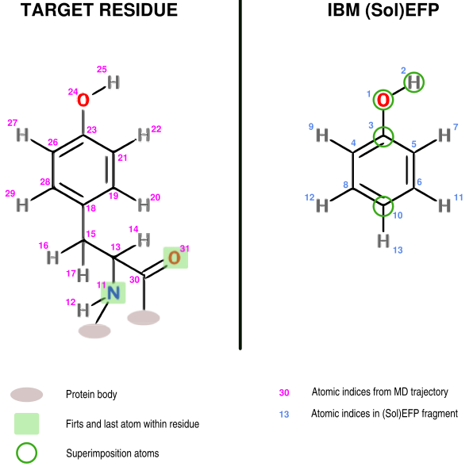

Effective Fragment Potentials: System Fragmentation 
===================================================

Bartosz Błasiak, Sept 18, 2017  Updated: 

INTRODUCTION
------------

SolEFP method is designed to meet the compromise between speed 
and accuracy in the vibrational solvatochromism calculations.
Therefore, the target system needs to be divided into certain **fragments**
that contain crucial functional groups and functionalities
responsible for the relevant intermolecular interactions.

## Superimosition.

In order to perform the fragmentation of the target system into
a set of separate BSM’s, the *superimposition* of SolEFP/EFP2 parameters
onto target (selected) geometry is required. Superimpositon is
a minimization of the RMS between comparable subsets of atoms
from the target system and BSM fragment, by finding an optimial
rotation matrix and translation vector.

Solvshift handles the technical aspect of the superimposition by

 1. **reordering lists**      - which tell the program which atoms from the target system
                                contain the essential features of BSM fragment.
 2. **superimposition lists** - that specify the atoms within the BSM which should
                                be considered for the superimposition;

An example and the application of these lists are explained in Figure 1 below.

******
**Figure 1. The assignment of SolEFP/EFP2 parameters for superimposition.** Assignment of the 
            reordering and superimposition lists is shown here on tyrosine side chain.
            The phenole fragment is modelled here by phenole as BSM. Exemplary values
            of atomic indices from MD topology are shown here in pink, whereas from BSM
            in blue. The entries of the reordering list are those from MD indices ordered 
            according to the BSM id’s. If BSM atom is not present in MD topology, then a value
            of zero is assumed. The entries of the superimposition lists constitute of BSM id’s
            placed in arbitrary order.

******

Thus

*******
Back to [Start](https://github.com/globulion/slv/tree/master/doc/tutor/README.md)

