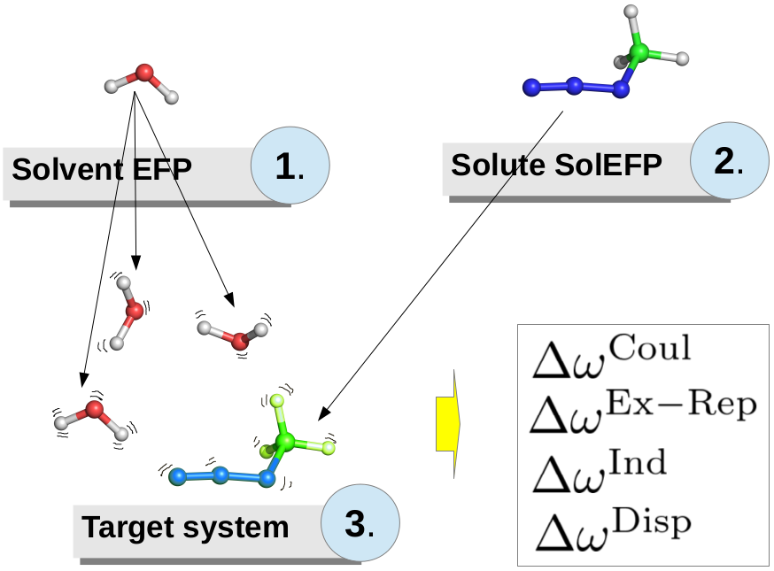

Effective Fragment Potentials
=============================

Bartosz Błasiak, May 5, 2017  Updated: 

INTRODUCTION
------------

SolEFP method is designed to meet the compromise between speed 
and accuracy in the vibrational solvatochromism calculations.
Therefore, it aims to study large and heterogeneous molecular 
systems, ranging from bulk solvents to even proteins.
In Figure 1, I depict the working principle of SolEFP.

******
**Figure 1. The principle of SolEFP.** 

******

FRG FILE FORMAT
---------------

In the following sections we show how to use EFP2 and SolEFP methods within Solvshift.
First, the *fragment parameter file format* (FRG) inherently used within SLV is explained.
Second, the generation of custom FRG files, both for solvent (EFP2), as well a solute 
(SolEFP), is outlined. Finally, SolEFP calculations are demonstrated on simple examples.

Fragment parameter file format is a Solvshift utility to manage large and extensive
quantum chemistry information on the benchmark solute/solvent molecule (BSM):

 * Atomic symbols, masses and structure
 * Basis set 
 * Distributed multipole moments 
 * Localized molecular orbital centroids
 * Distributed polarizabilities
 * Wave function and Fock matrix
 * Vibrational analysis (frequencies, eigenvectors, reduced masses and cubic anharmonic constants)
 * First and second derivatives of multipoles, polarizabilities, wave function and Fock matrix
   with respect to normal coordinates of solute.

Solvshift
has an internal library of BSM's which are stored under `solvshift/dat` directory.

> WARNING: User should never change the contents of FRG file except adding comments after `!` sign.
> Changes in numerical values will result in errors in calculations and unphysical results!

To get a detailed information on the FRG file format, refer to the documentation of class `Frag`.
```python
from solvshift.slvpar import Frag
help(Frag)
```
As one can see, class `Frag` handles FRG objects and can be easily accessed from Python level.
FRG file can be read in a following way:
```python
frg1 = Frag('water')
frg2 = Frag('/path/to/custom/fragment/bsm.frg')
```
In the first case we read fragment from SLV library by simply invoking a name of a molecule.
The corresponding file is located at `$SLV_DATA/frg` directory. Note that the actual path and postfix 
`.frg` have been ommited here. If we want to use custom fragment that we had not
added to SLV library (second case), we need to specify the entire path to the file of interest.

PREPARING CUSTOM FRG FILES
--------------------------

Preparation of FRG files is automatized by the tools `slv_efp-frg` (designed for solvent files)
and `slv_solefp-frg` (solute files). In each case, a series of calculations by using the Gaussian
and GAMESS US programs are necessary before SLV tools can be used. During these initial calculations, 
structures should be energy-optimized in Gaussian and EFP file(s) generated by GAMESS. In the case
of solute, a series of EFP files and formatted checkpoint files (FCHK) need to be obtained. After
these initial calculations, Solvshift calculates all the parameters and stores them in FRG output file.

### Solvent FRG files.

The following command needs to be run in order to create solvent FRG file.
```
slv_efp-frg [fchk] [camm] None [Gamess efp] [output file] <basis>
```
So far, HF/6-311++G** 6D method was tested and is recommended. 

> The keyword `None` will be deprecated in the future. Originally, GAMESS output file was necessary
> to read Fock matrix. However, later changes in the code enabled Fock matrices to be computed by Solvshift and 
> GAMESS log files are no longer necessary. 

#### Generation of FCHK file.

FCHK file can be obtained from Gaussian CHK files by using `formchk` utility provided by Gaussian.
The input for the generation of CHK file is here provided as an example:
```
%chk=water.chk
%mem=1000mb
%nprocshared=4

#P RHF/6-311++G** 6D scf(conver=11,xqc,novaracc) nosymm

CHK file for water

0 1
O    0.000000    0.113009    0.000000
H    0.752785   -0.452035    0.000000
H   -0.752785   -0.452035    0.000000

```
> WARNING: The keywords `6D` and `nosymm` are absolutely crucial here and cannot be omitted. 
> Otherwise, the results will be totally wrong.

#### Generation of CAMM file.

CAMM file contains the distributed multipole analysis that needs to be computed by Solvshift.
To create CAMM file, FCHK file needs to be created first. The tool for doing this 
is `slv_gen-camm` and the usage is very simple:
```
slv_gen-camm [method] [basis]
```

> NOTE. The script will compute CAMM files for all FCHK files in the working directory.

`method` is the level of theory which was used to compute one-particle
density matrices (Solvshift module `coulomb` uses them to compute CAMM).
Available methods are `SCF`, `MP2` and `CC`. However, to create FRG file
Hartree-Fock is always used. Therefore, `SCF` method should be specified.
The overall command for water example is as follows:
```
slv_gen-camm SCF 6-311++G**
```
If `water.fchk` file is saved in the working directory, the script will generate
`water.camm` file.

#### Generation of EFP file

EFP file has to be created by using `MAKEFP` routine of GAMESS US program.
Refer to GAMESS manual for usage.
The required input file for water example is given below:
```
 $system mwords=100 memddi=2 parall=.t. $end
 $contrl scftyp=rhf runtyp=makefp icharg=0 mult=1 units=angs
         maxit=100 exetyp=run ispher=-1 nprint=7
         mplevl=0 cctyp=none icut=20 itol=30 local=pop $end
 $local  fcore=.false. maxloc=5000 cvgloc=1e-10 $end
 $scf    dirscf=.t. fdiff=.f. diis=.t. soscf=.f.
         conv=1d-11  $end
 $basis  gbasis=slvbas extfil=.true. $end
 $data
 --- EFP2 PARAMETERS FOR WATER; RHF/6-311++G** ---
C1 0
O    8.0    0.000000    0.113009    0.000000
H    1.0    0.752785   -0.452035    0.000000
H    1.0   -0.752785   -0.452035    0.000000
 $end
```

For the detailed input keywords explanation refer to the GAMESS manual.
Shortly, this task specifies generation of EFP2 parameters for 
closed shell neutral water molecule described at the Hartree-Fock level
of theory. Canonical orbitals are to be localized by using the Pipek-Mezey method
with the tight convergence criterion for the transformation matrix. 
The basis set uses Cartesian *d*
orbitals on oxygen (six Gaussian-type functions per one *d* orbital). Note that the basis
set specified here is not a standard GAMESS built-in basis set, but it is read
from an external file, `slvbas` (which is in your `$EXTBAS` directory that is
specified within the GAMESS `rungms` or `gms-files.csh` scripts). The file contains the basis
set that is identical to the basis set used in Gaussian to maintain compatibility.
The `slvbas` file for 6-311++G** basis set and H, Li, C, N, O, F, Na, S and Cl elements 
can be found [here](https://github.com/globulion/slv/blob/master/dat/slvbas). 
> Note that,
> if you want to use different basis set or elements other than specified above,
> you need to create external basis file on your own.

#### Generation of FRG file from FCHK, CAMM and EFP file.

For water molecule example, the command that needs to be run is as follows:
```
slv_efp-frg water.fchk water.camm None water.efp water.frg 6-311++G**
```
The output `water.frg` is the final BSM file for solvent.


### Solute FRG files.

In order to complete FRG file generation for solute one has to perform first two separate calculations in Gaussian:
1. Energy optimization with very tight criteria on RMS force
2. Vibrational anharmonic analysis 

In energy optimization, `VeryTight` option is a must. Also, remember to use `nosymm` and `6D` all the time!
The exemplary input for the anharmonic analysis job for nitrile stretch mode of MeSCN is shown below:
```
%chk=mescn.chk

#P RHF/6-311++G** 6D Freq(HPModes,Anharmonic,VibRot) IOP(7/33=1) IOP(6/7=3)
# SCF(xqc,novaracc,conver=11) nosymm

Anharmonic analysis of MeSCN

0 1
C           -0.092914    0.771679    0.000158
N           -0.102701    1.903282   -0.000034
S           -0.115436   -0.933093    0.000459
C            1.677325   -1.260633   -0.000074
H            1.771178   -2.338438    0.000081
H            2.133749   -0.853883   -0.889963
H            2.134334   -0.853576    0.889374

```

Notes about keywords:
* Keyword `6D` is necessary (d-functions in basis set are Cartesian, not spherical). 
  It is because I have implemented Cartesian basis sets in Solvshift and the Gaussian log file needs to be compatible with this.
* Keyword `nosymm` needs to be added all the time as well. This is because otherwise the turn of basis orbitals will be different
  between Gaussian and Solvshift routines and FCHK files will be parsed incorrectly!
* Gaussian log file format in one place had changed over time. When I wrote part of Solvshift responsible for reading g09 logs 
  I used old version of Gaussian09. Later they changed one part in log file and since then you need to manually modify 
  it (otherwise Solvshift will not be able to read file with anharmonic analysis and will prompt error message). 
  The change one needs to do is to find the line containing `Z-matrix`, cut the whole line and paste it one line above. 
  The correct final form should be
  ```
  Symbolic Z-matrix:
  Charge =  0 Multiplicity = 1
  ```

Now we are ready to generate all the necessary input files for finite field differentiations.
These are FCHK as well as EFP files.
It is very easy to create all inputs after the anharmonic file has been obtained.
The command is:
```
slv_solefp-frg -i [anh] -s [step] -S [step_sder] -m [mode] -x [xyz] 
```
where `anh` is the Gaussian (modified as described above) file, `step` and `step_der` are the differentiation step
in Cartesian and normal mode coordinate space, respectively, 
`mode` is the normal mode number (in this case number of the nitrile 
stretch mode of MeSCN; see below) and `xyz` is the gas-phase optimized XYZ structure file.

Normal mode number is understood as the number of vibration listed in the section of anharmonic analysis 
in the g09 log file. Search for keyword `Fundamental`.
For example, in the case of MeSCN the contents looks like this:
```
 Mode(Quanta)      E(harm)     E(anharm)     Aa(z)       Ba(x)       Ca(y)
 Equilibrium Geometry                        0.531422    0.137969    0.111851
 Ground State      10979.057   10863.237      0.527620    0.137753    0.111312
 Fundamental Bands (DE w.r.t. Ground State)
   1(1)      3310.005    3182.019     0.527875    0.137772    0.111329
   2(1)      3296.832    3171.739     0.527754    0.137668    0.111296
   3(1)      3202.947    3140.377     0.527509    0.137706    0.111296
   4(1)      2526.277    2498.925     0.527249    0.137295    0.110995
   5(1)      1600.518    1558.049     0.527616    0.138112    0.111485
   6(1)      1584.874    1541.084     0.532019    0.137324    0.111307
   7(1)      1489.840    1458.774     0.522071    0.137729    0.111061
   8(1)      1100.164    1082.741     0.526564    0.137910    0.111210
   9(1)      1071.423    1056.073     0.525424    0.137530    0.111206
  10(1)       754.892     740.764     0.524155    0.137665    0.111235
  11(1)       711.767     712.812     0.526647    0.137375    0.110867
  12(1)       507.542     505.145     0.541237    0.137802    0.111235
  13(1)       437.797     439.741     0.514335    0.137911    0.111494
  14(1)       193.599     194.504     0.532961    0.138395    0.111356
  15(1)       169.635     158.833     0.523285    0.137661    0.111223
 Overtones (DE w.r.t. Ground State)
   1(2)             6620.010    6303.557     0.528130    0.137792    0.111346
   2(2)             6593.664    6290.890     0.527888    0.137584    0.111281
   3(2)             6405.895    6142.908     0.527398    0.137660    0.111280
...
```
In the example we are interested in CN stretch mode - so the `-m 4` has to be used. 

Running the input file generation procedure by `slv_solefp-frg` script creates
a series of input files:
 1. Gaussian input files to get one-particle density matrices (FCHK files)
 2. Gaussian input files to get Hessian matrices (FCHK files) necessary to compute
    cubic anharmonic constants
 3. GAMESS input files to obtain distributed polarizabilities (EFP files)

To create these input files two templates are necessary. They will be first
written automatically by Solvshift to your working directory by the first run of
`slv_solefp-frg` script. Then you must re-run the
script to create the inputs after modifying the template files appropriately
to your needs. Templates for 6-311++G** Cartesian basis set can be found
in the links 
[Gaussian template](https://github.com/globulion/slv/tree/master/dat/gaussian.templ) 
and 
[GAMESS template](https://github.com/globulion/slv/tree/master/dat/gamess.templ).
> Note that in the GAMESS input template the basis set name is `slvbas` instead
> of the conventional GAMESS basis set nomenclature. 
> Refer [here](#generation-of-efp-file) 
> for mode details on this.

> Note also, that Solvshift creates the separate Gaussian input files for second derivatives
> with respect to the mode of interest (in this case CN stretch) in a separate directory
> `sder/%step_sder`. These additional five input files are only Gaussian tasks.

Once all the input files are generated, two tarballs are created: `inp_g09.tar.bz2`
and `inp_gms.tar.bz2`. They can be sent to your computer cluster for evaluation. 
Thus, for our example with MeSCN, the required command would be as follows:
```
slv_solefp-frg -i mescn-anh.log -s 0.006 -S 15.0 -m 4 -x mescn.xyz
```
After completing all the tasks copy the Gaussian output files and EFP files 
(Gaussian with extension `.log` and GAMESS ending with `.efp`) 
to the directories of their parent input (`.inp`) files, including the `sder` directory.

#### Computation of SolEFP FRG file.

After the last step, you are ready to compute the SolEFP FRG file for your solute!
The command is
```
slv_solefp-frg -c [anh] -s [step] -S [step_sder] -m [mode] -f [fchk] -d [dma] -e [efp] -o [frg] (--omit_camm)
```
`-d` option indicates the distributed multipole analysis file for the solute molecule.
Here, it will be one of the files created by Solvshift during this step. 
If your Gaussian input file of gas-phase solute structure is 
`g09_mescn_A000_D00_.inp` (for the example case of MeSCN)
the CAMM file is just `g09_mescn_A000_D00_.camm`. 

> Here in this step you must pass files with only `_A000_D00_` string which refers
> to the gas-phase structure. All other files refer to displacements of atoms for
> finite difference purposes and, hence, cannot be passed here to compute SolEFP parameters.

`-e` option indicates the EFP file for gas-phase solute (e.g., `gms_mescn_A000_D00_.efp`).

`-o` option is the name of the FRG file you want to generate.

`--omit_camm` option is useful if you want to recalculate the SolEFP parameters, but
you do not want to compute all the CAMM's again (otherwise Solvshift would compute CAMM's
once again which would take quite long time.

The command line for our MeSCN example is
```
slv_solefp-frg -c mescn-freq.log -s 0.006 -S 15.0 -m 4 -f g09_mescn_A000_D00_.fchk -d g09_mescn_A000_D00_.camm -e gms_mescn_A000_D00_.efp -o mescn.frg 
```
This step first computes the SolEFP parameters for Coulomb interactions, then calculates parameters
for exchange-repulsion, and at the end parameters for induction and dispersion. It also computes
the cubic anharmonic constants and constructs the final `mescn.frg` file. All these calculations
might take up some time (up to one hour if CAMM's are to be computed and a few minutes otherwise).
This file can be already used in the SolEFP calculations!


*******
Back to [Start](https://github.com/globulion/slv/tree/master/doc/tutor/README.md)

