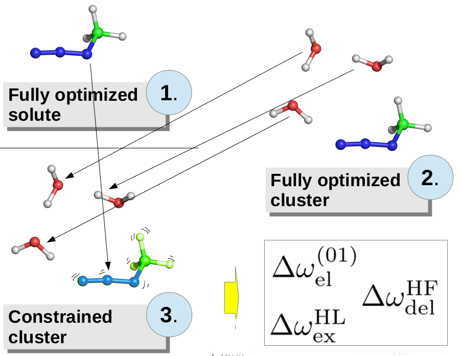

Vibrational Solvatochromism from Molecular Dynamics
===================================================

Bartosz Błasiak, May 5, 2017  Updated: 

INTRODUCTION
------------

This section of the Mini-Tutorial describes how to use Solvshift
to analyze the molecular dynamics (MD) trajectory files.

******
**Figure 1. The principle of SolEDS.** 

******

Back to [Start](https://github.com/globulion/slv/tree/master/doc/tutor/README.md)

