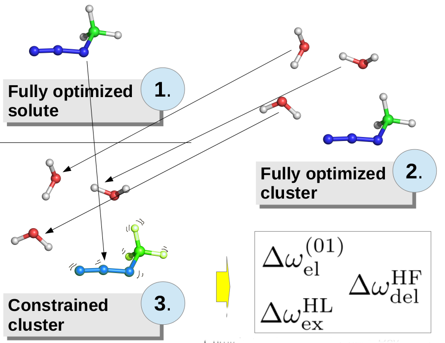

Mini-Tutorial
=============

Bartosz Błasiak, Summer 2013, Updated: 25 April 2017

INTRODUCTION
------------

The following small tutorial has the aim to introduce the reader into the basic use of **Solvshift** package.
If your dream is modelling the solvatochromic response of molecule immerged in solvent environment of other
molecules **this package is just for you!** Note that this software is a relatively fresh born tool and is still under 
current intensive work. Therefore, it is still under development stage and has not been published.

For the time being, **Solvshift** is generally a tool for calculation of solvatochromic vibrational frequency 
shifts using mostly **coarse-grained** [models](https://github.com/globulion/slv/blob/master/README.md). 
In the future the solvatochromic interaction-induced transition dipole change,
simulation of 1D and 2D infrared spectra and general improvement of accuracy and performance 
are under constant development. See the [ToDo lists] for reference upon
future development plans.

MODES OF OPERATION
------------------

**Solvshift** offers two modes of operation: 
1. [Input](https://github.com/globulion/slv/blob/master/doc/tutor/Inputs.md) and 
2. [Calculation](https://github.com/globulion/slv/blob/master/doc/tutor/Calculations.md) mode. 
The *Input* mode creates input files needed for finite difference calculations using various differentiation schemes. 
The default is 5-point central Stencil method. The *Calculation* mode offers calculation of solvatochromic parameters,
saving them on the computer disk and calculation of frequency shifts by using available methods that are implemented
in **Solvshift**.

INTERACTING WITH **Solvshift** 
------------------------------

Solvshift can be used by many ways depending on what task is to be performed.



### Interacting through main executable.

In general, simple calculations and tasks can be specified by using the 
**Solvshift** main executable script, `slv`. 
To see the version information run:
```
slv
```
The command
```
slv --help
```
will result in help box with a detailed description of Solvshift functionalities and usage if .


[ToDo lists]: https://github.com/globulion/slv/projects/1
